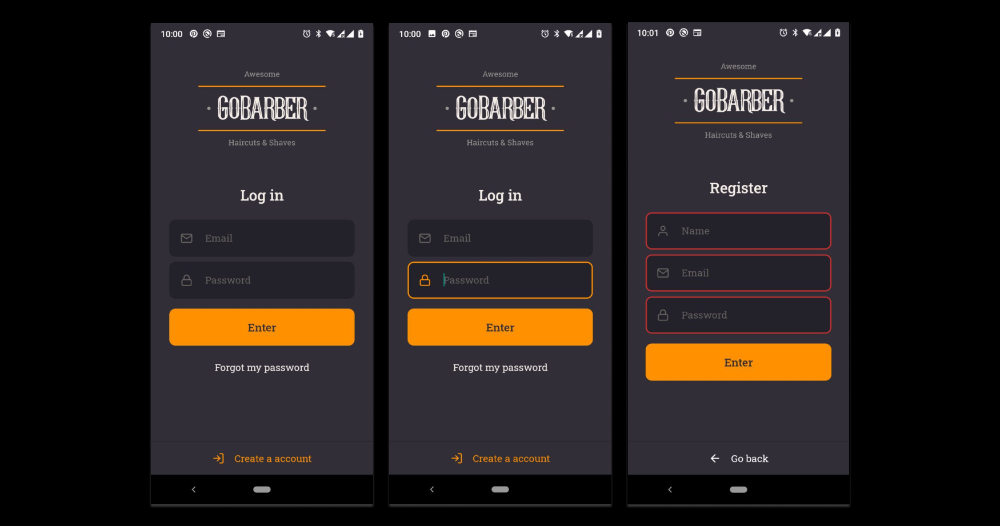

<h1 align="center">
   GoBarber Mobile (Work in progress)
</h1>

## Introduction

GoBarber is an app to doing schedule request for barber shops.

This application has three parts, this repository is a the mobile application.
The backend is available here: [gobarber-backend](https://github.com/mouracamila/node-typescript-project)
And the frontend here: [gobarber-web](https://github.com/mouracamila/gobarber-web)

  

## How to use

1. Clone this Repository:

   `$ git clone git@github.com:mouracamila/gobarber-mobile.git`

2. Installing dependencies:

   `$ yarn install`

3. Running project:

   `$ yarn start`

4. Run emulator:

   `$ yarn android` or `$ yarn ios`

##### Obs: **npm** should be run where **package.json** is in your project
